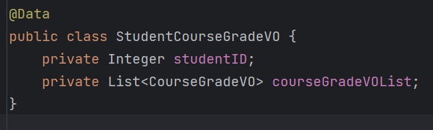
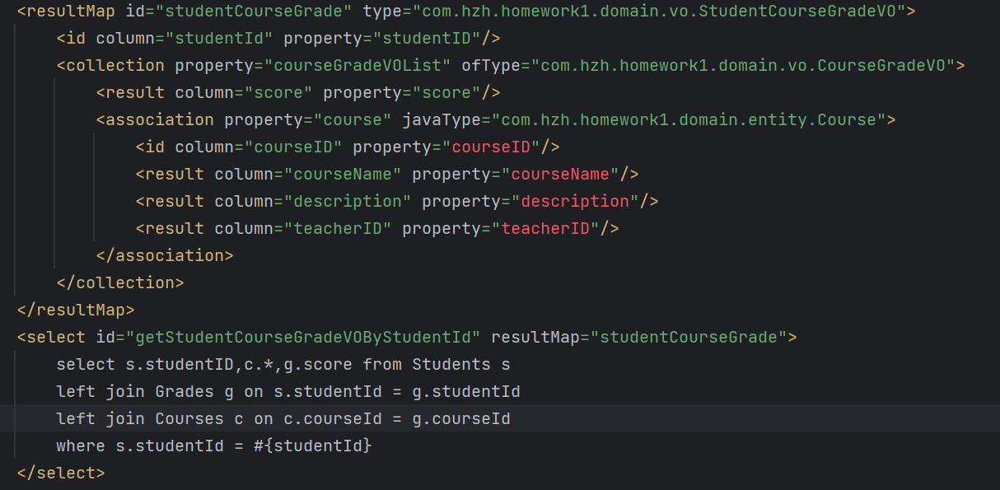
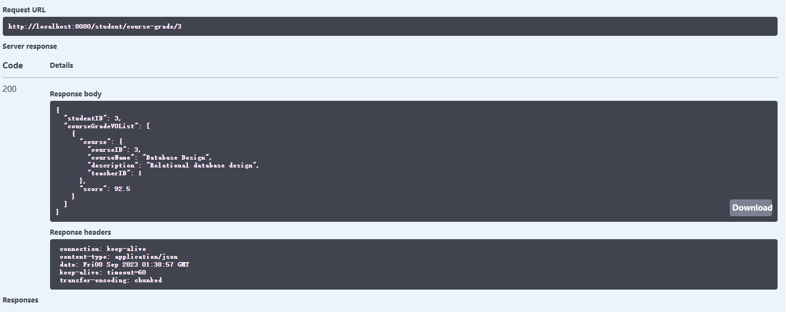
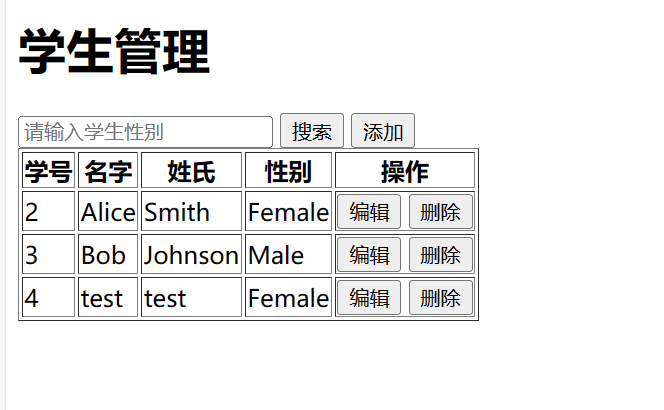
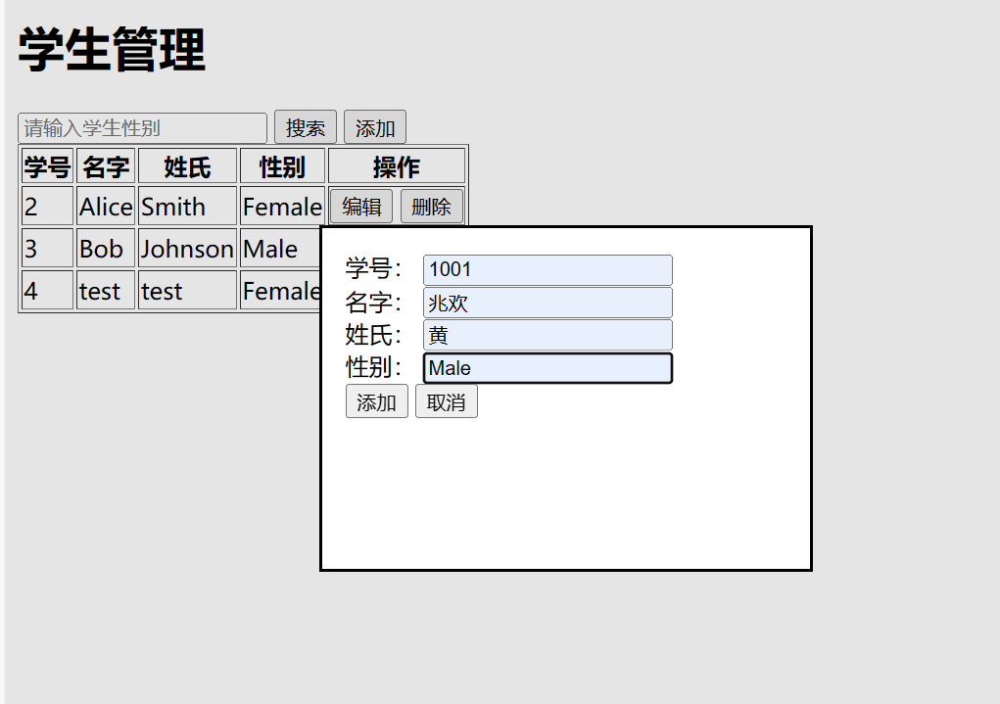
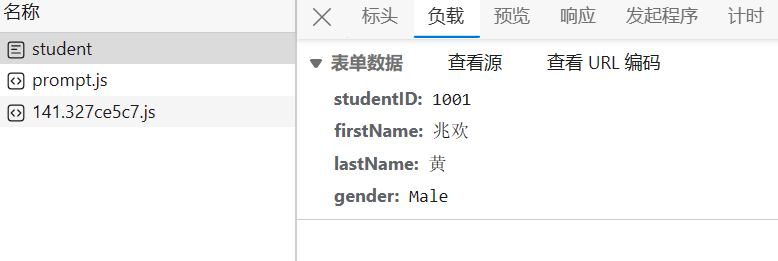
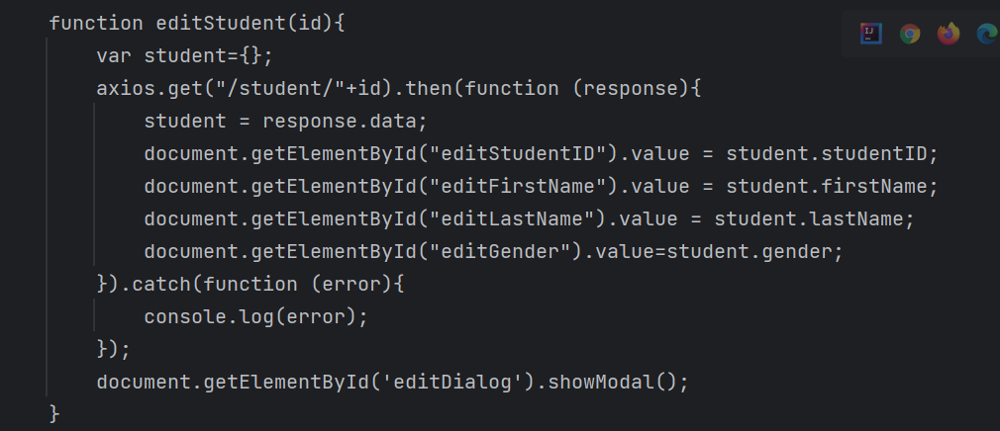
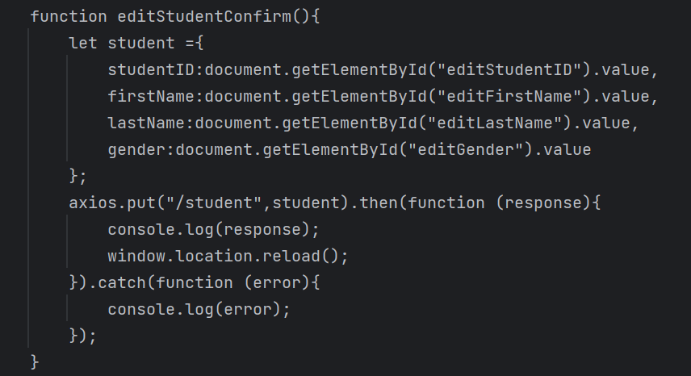
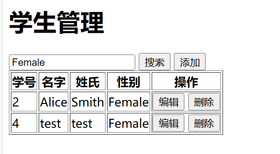

# 一、Mybatis相关使用
```agsl
1.创建了StudentCourseGradeVO类，用于封装学生的课程成绩信息
```

```agsl
2.在StudentMapper.xml中，编写了用于查询学生的课程成绩信息的SQL
```

```agsl
3.在StudentMapper.java中，编写了用于查询学生的课程成绩信息的方法，并使用swagger查询成功
```

```agsl
学习总结：学习了SpringBoot的基本用法和配置，整合Mybatis以及在Mybatis中动态SQL的用法。
整个项目结构遵循DDD领域驱动设计，使得整个项目的扩展性和可维护性更强。
```

# 二、SpringBoot整合Thymeleaf模板引擎
```agsl
1.创建了student.html页面，用于展示学生的课程成绩信息,并使用thymeleaf模板引擎进行数据的渲染,效果如下
```

```agsl
2.增加学生页面使用dialog弹窗，添加后表单发送post请求传递表单数据至StudentController中的insertStudent方法，效果如下
```


```agsl
3.修改学生页面同样使用了dialog弹窗，先通过get请求获取学生信息，再将学生信息传递至StudentController中的updateStudent方法
```


```agsl
4.点击删除按钮后，ajax发送delete请求，将学生id传递至StudentController中的deleteStudent方法
```
```agsl
5.查询页面使用了table标签，并使用th:each进行遍历，不指定条件则返回全部学生，通过Mybatis的动态SQL实现，效果如下
```

```agsl
学习总结：学习了Thymeleaf模板引擎的基本用法，以及使用Thymeleaf模板引擎实现了增删改查的功能。途中遇到一些困难，例如提交表单后会跳转至空页面，最终使用了ajax解决了这个问题。
```